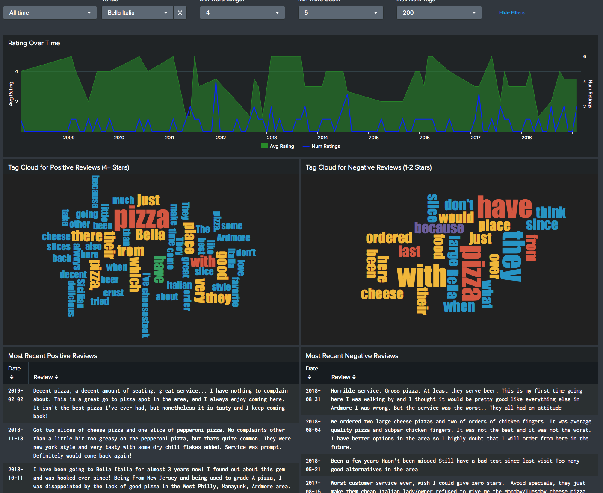
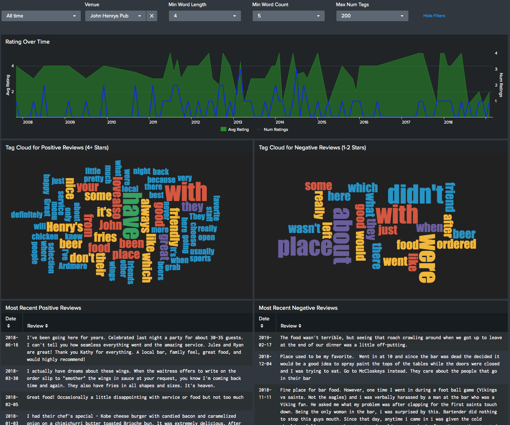

# Splunking Yelp Reviews

Awhile ago, I wanted go out to dinner, but wasn't sure which of a few different
venues I wanted to go to.  They all had high ratings on Yelp, but that didn't
tell the entire story.  So I built this app to Splunk Yelp reviews, which can tell you:

- Avg ratings/number of ratings over time
- Most 5 recent positive/negative reviews
- Tag cloud of words from positive/negative reviews

In real-life, I've used this app to see what the biggest complaints are
about a venue (ordering over the phone), and since they didn't apply to me, 
decide I still wanted to eat there.

This app uses <a href="https://github.com/dmuth/splunk-lab">Splunk Lab</a>, an open-source 
app I built to effortlessly run Splunk in a Docker container.

# Screenshots

## Requirements

- Docker
- Python 3

## Installation

- `pip3 install -r ./requirements.txt` - Install required Python modules
- `./bin/download-reviews-from-url.sh ./urls.txt` - Download reviews from Yelp. Change `urls.txt` with URLs for different venues on Yelp as needed.  This does not use the API, because the API only returns like 3 reviews, which is silly. Instead, I grab the page contents and use <a href="https://www.crummy.com/software/BeautifulSoup/bs4/doc/">Beautiful Soup</a> to parse the HTML contents.
   - Note that I included some reviews in `logs/`, so if you skip this step and instead just start up Splunk, you'll be able to see some pre-populated dashboards!
- `SPLUNK_PASSWORD=password1 SPLUNK_START_ARGS=--accept-license ./bin/start.sh` - Start Splunk!
- Go to <a href="https://localhost:8000/">https://localhost:8000/</a>, log in with the password you set, and you'll see the Yelp Reviews Dashboard.

When done, run `./bin/stop.sh` or `./bin/clean.sh` to stop Splunk or clean up.

## Troubleshooting

- Q: Dashboards show ` Search is waiting for input...`
- A: You need to select a venue in the dropdown!  If no items are in the dropdown, that means no data was ingested.  Did you run `./bin/download-reviews.sh`?

## Credits

I'd like to thank <a href="http://splunk.com/">Splunk</a>, for having such a kick-ass data
analytics platform, and the operational excellence which it embodies.

## Contact

- <a href="mailto:doug.muth@gmail.com">Email me</a>
- <a href="https://twitter.com/dmuth">Twitter</a>
- <a href="https://facebook.com/dmuth">Facebook</a>

