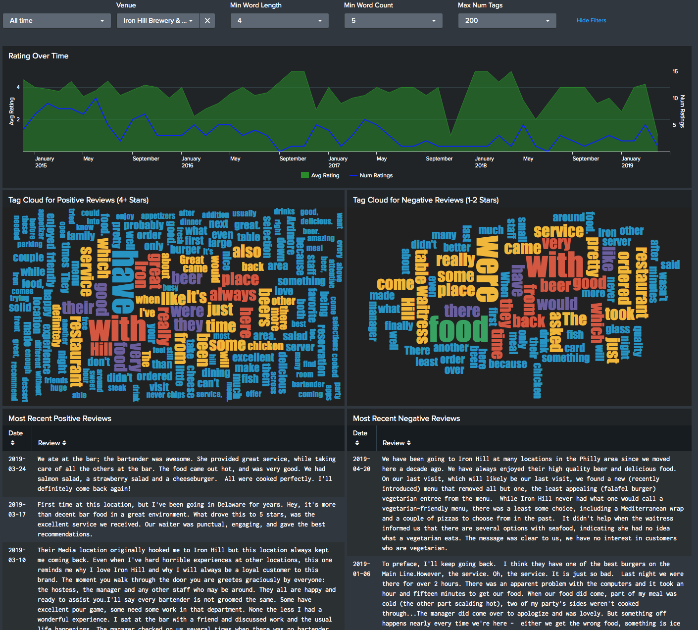

# Splunking Yelp Reviews

Awhile ago, I wanted go out to dinner, but wasn't sure which of a few different
venues I wanted to go to.  They all had high ratings on Yelp, but that didn't
tell the entire story.  So I built this app to Splunk Yelp reviews, which can tell you:

- Avg ratings/number of ratings over time
- Most 5 recent positive/negative reviews
- Tag cloud of words from positive/negative reviews

In real-life, I've used this app to see what the biggest complaints are
about a venue (ordering over the phone), and since they didn't apply to me, 
decide I still wanted to eat there.

This app uses <a href="https://github.com/dmuth/splunk-lab">Splunk Lab</a>, an open-source 
app I built to effortlessly run Splunk in a Docker container.

# Screenshots

## Requirements

- Docker

## Docker

- `bash <(curl -s https://raw.githubusercontent.com/dmuth/splunk-yelp-reviews/master/1-download-from-yelp.sh) ./urls.txt`
   - Download reviews from Yelp. The file `urls.txt` should contain one URL per line, and each URL should be a venue's page on Yelp <a href="https://www.yelp.com/biz/john-henrys-pub-ardmore">such as this one</a>.  This does not use the API, because the API only returns like 3 reviews, which is silly. Instead, I grab the page contents and use <a href="https://www.crummy.com/software/BeautifulSoup/bs4/doc/">Beautiful Soup</a> to parse the HTML contents.
- `SPLUNK_PASSWORD=password1 SPLUNK_START_ARGS=--accept-license ./2-splunk.sh` - Start Splunk!
- Go to <a href="https://localhost:8000/">https://localhost:8000/</a>, log in with the password you set, and you'll see the Yelp Reviews Dashboard.

## Troubleshooting

- Q: Dashboards show ` Search is waiting for input...`
- A: You need to select a venue in the dropdown!  If no items are in the dropdown, that means no data was ingested.  Did you run the command to download some Yelp reviews?

## Development

Mostly for my benefit, these are the scripts that I use to make my life easier:

- `./bin/build.sh` - Build the Python Docker container
- `./bin/push.sh` - Upload the Docker container to Docker Hub
- `./bin/devel.sh` - Build and run the Docker container with an interactive shell
- `./bin/stop.sh` - Stop the Splunk container
- `./bin/clean.sh` - Stop Splunk, and remove the data and logs

## Credits

I'd like to thank <a href="http://splunk.com/">Splunk</a>, for having such a kick-ass data
analytics platform, and the operational excellence which it embodies.

## Copyright

Splunk is copyright by Splunk.  Apps within Splunk Lab are copyright their creators,
and made available under the respective license.  

## Contact

- <a href="mailto:doug.muth@gmail.com">Email me</a>
- <a href="https://twitter.com/dmuth">Twitter</a>
- <a href="https://facebook.com/dmuth">Facebook</a>

